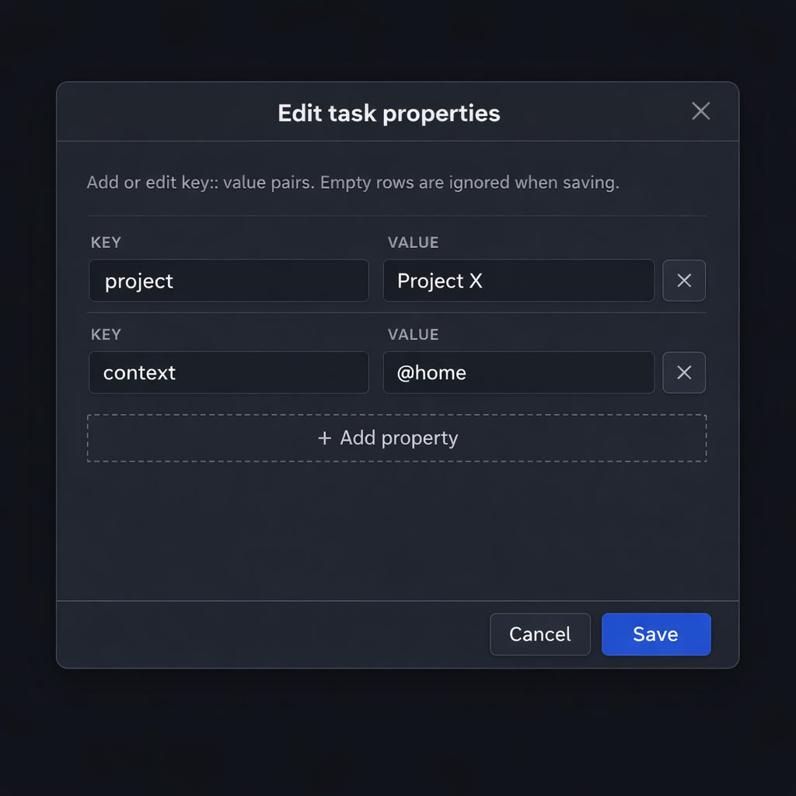

# Tasks

Outliner-focused task management for Obsidian with a query-based side pane. Tasks use state keywords (TODO, DOING, DONE, etc.), optional priorities, tags, and properties.

## Screenshots

### Task panel

Tasks are grouped by page. Each card shows state, priority, and a pencil button for properties. Click any card to jump to that line in the note.


### Query filters

Expand the filter section to narrow tasks by state, priority, tags, or properties.


### Property editor

Edit `key:: value` pairs for any task from a modal dialog.



## Task syntax

- **States**: Lines starting with `TODO`, `DOING`, `DONE`, `CANCELED`, or `WAITING` are treated as tasks. An optional list bullet (`-` or `*`) before the keyword is supported:

```markdown
TODO [#A] Implement task parser #work
- DOING Investigate bug in project X #debug
* DONE [#C] Refactor helper function
```

- **Priorities**: Optional `[#A]`, `[#B]`, or `[#C]` immediately after the state.
- **Tags**: Inline `#tags` in the task text are indexed and can be used in filters.
- **Properties**: Lines immediately under a task that match `key:: value` are stored as properties:

```markdown
TODO Implement indexer #work
project:: Project X
context:: @home
```

## Task panel

Open the **Tasks** pane from the ribbon icon (check-circle) or the command **"Open Tasks view"**.

- All tasks in your vault are listed and **grouped by page** (file).
- **Header**: Title "Tasks", task count badge, and a **chevron** to expand/collapse the query filters section (collapsed by default).
- **Query filters** (when expanded):
  - **State**: TODO, DOING, DONE, CANCELED, WAITING, or All.
  - **Priority**: All, #A, #B, #C, or None.
  - **Tags**: Space-separated tags (e.g. `#work #urgent`); substring match.
  - **Property**: One or more key/value filters. Key and value dropdowns are filled from existing task properties. Use "+ Add" for multiple property filters (AND). Remove with "×". **Clear** resets all filters.
- **Task cards**:
  - **First line**: State button (cycle TODO → DOING → DONE → CANCELED → TODO), priority button (cycle none → #C → #B → #A), and **pencil** icon to edit properties.
  - **Second line**: Task description.
- **Interactions**:
  - **Click the card** (or the task text) to open the note and **jump to that task’s line** (cursor and scroll).
  - **State / priority / pencil**: Use the buttons without triggering jump (click only the card body to jump).
- The list **refreshes automatically** when files in the vault change.

## Commands

- **Open Tasks view**: Opens the Tasks side pane.
- **Cycle task state at cursor**: With the cursor on a task line in the editor, cycles the state (TODO → DOING → DONE → CANCELED → TODO). If the task is in the index, the index is updated; otherwise only the line text is changed. You can assign a hotkey in **Settings → Hotkeys** under **Tasks**.

## Development

1. Install dependencies:

```bash
cd obsidian-logseq-tasks
npm install
```

2. Build the plugin:

```bash
npm run build
```

3. Copy or symlink the plugin folder into your vault’s `.obsidian/plugins` directory (e.g. `.obsidian/plugins/obsidian-logseq-tasks`).

4. Enable **Tasks** in **Settings → Community plugins**.

5. Use **npm run dev** for watch mode while developing.

## Donate

If this plugin helps you, consider supporting its development:

| Platform | Link |
| -------- | ---- |
| **GitHub Sponsors** | [Sponsor on GitHub](https://github.com/sponsors/tomisacat) |

Thank you for your support.
